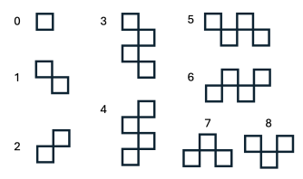
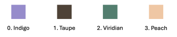

# ML Playground

Here is a repository of my exploration with small ML projects! This repository is a collection of small machine learning projects that I’m exploring for fun and to learn more about ML and LLMs! Each project lives in its own file/folder and focuses on experimenting with different ML concepts, libraries, or applications.  

---

## 📌 Projects

### 1. Text-to-Image Generation (Stable Diffusion)

A simple Python application that generates images from text prompts using [Stable Diffusion](https://huggingface.co/sd-legacy/stable-diffusion-v1-5) via the Hugging Face `diffusers` library. Unlike cloud-based APIs, this project runs the Stable Diffusion model locally on your GPU using PyTorch, giving full control and faster generation if you have CUDA available.

**Features:**
- Generate images from natural language prompts
- Runs the model locally on your GPU (no API calls required)
- Preview generated images directly
- Option to save images with a custom filename
- Run interactively in the terminal or UI with Streamlit
- To run: `python -m streamlit run image_gen_app_streamlit.py`

### 2. Book Description Generator (Finetuning a GPT Model)

This project explores LLMs using Hugging Face `transformers`, starting from a training notebook and culminating in a Streamlit web app that generates story plot ideas based on user prompts. The model used in this application is a fine-tuned [DistilGPT-2 model](https://huggingface.co/distilbert/distilgpt2) and is trained on the [Top 100 Goodreads Books' Descriptions from 1980 to 2023](https://www.kaggle.com/datasets/cristaliss/ultimate-book-collection-top-100-books-up-to-2023).

**Features:**
- Generate book plots from typing the beginning of a plot idea
- Enter the beginning of a story idea and let the model complete it (e.g. *"In a distant galaxy, far far away..."*)
- Runs locally using the fine-tuned GPT-2 checkpoint
- Interactive UI with Streamlit
- To run: `streamlit run app.py`

### 3. Shape Coloring Solver (Heuristic Local Search)
A Python-based AI agent that solves the Shape Placement Grid Game using stochastic local search, simulated annealing, and random restarts. The objective of the game is to fill a grid entirely with colored geometric shapes such that:
- All cells are covered with no empty space
- No two adjacent cells share the same color
- No shapes overlap
This project on applying local search techniques, commonly used in AI optimization problems, to a spatial reasoning and constraint satisfaction task. The shapes and colors are as shown below:

**Features:**
- Implements First-Choice Hill Climbing to iteratively improve the grid configuration
- Integrates Simulated Annealing for probabilistic acceptance of worse states, enabling exploration beyond local maxima
- Uses Random Restarts to recover from stagnation when no improvement occurs after several iterations
- Dynamically evaluates grid states using a custom heuristic function that penalizes: adjacent color conflicts, empty cells, excessive shape count, and unused colors

**Algorithm Overview:**
1. Randomly select an empty cell and attempt to place a valid shape and color.
2. Evaluate the resulting grid using the heuristic function.
3. If the move improves the heuristic score (or passes the simulated annealing probability test), accept it; otherwise, undo it.
4. If no improvement occurs after 15–30 steps, partially or fully reset the board (random restart).
5. Continue until all cells are filled and adjacency constraints are satisfied.

---

## 📚 Notes

These projects are for learning and exploration only.
I’m experimenting, breaking things, and documenting my progress here.

Feel free to explore, fork, or suggest fun ideas! 🚀
