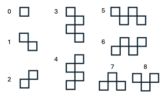
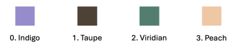

# ML Playground

Here is a repository of my exploration with small ML projects! This repository is a collection of small machine learning projects that I’m exploring for fun and to learn more about ML and LLMs! Each project lives in its own folder and focuses on experimenting with different ML concepts, libraries, or applications. Using `Python 3.11.5`. Download requirements via `pip install -r requirements.txt`, preferably in its own virtual environment.

---

## Projects

### 1. Text-to-Image Generation (Stable Diffusion)

A simple Python application that generates images from text prompts using [Stable Diffusion](https://huggingface.co/sd-legacy/stable-diffusion-v1-5) via the Hugging Face `diffusers` library. Unlike cloud-based APIs, this project runs the Stable Diffusion model locally on your GPU using PyTorch, giving full control and faster generation if you have CUDA available.

**Features:**
- Generate images from natural language prompts
- Runs the model locally on your GPU (no API calls required)
- Preview generated images directly
- Option to save images with a custom filename
- Run interactively in the terminal or UI with Streamlit
- To run: `python -m streamlit run image_gen_app_streamlit.py`

### 2. Book Description Generator (Finetuning a GPT Model)

This project explores LLMs using Hugging Face `transformers`, starting from a training notebook and culminating in a Streamlit web app that generates story plot ideas based on user prompts. The model used in this application is a fine-tuned [DistilGPT-2 model](https://huggingface.co/distilbert/distilgpt2) and is trained on the [Top 100 Goodreads Books' Descriptions from 1980 to 2023](https://www.kaggle.com/datasets/cristaliss/ultimate-book-collection-top-100-books-up-to-2023).

**Features:**
- Generate book plots from typing the beginning of a plot idea
- Enter the beginning of a story idea and let the model complete it (e.g. *"In a distant galaxy, far far away..."*)
- Runs locally using the fine-tuned GPT-2 checkpoint
- Interactive UI with Streamlit
- To run: `streamlit run app.py`

### 3. Shape Coloring Solver (Heuristic Local Search)
A Python-based AI agent that solves the Shape Placement Grid Game using stochastic local search, simulated annealing, and random restarts. The objective of the game is to fill a grid entirely with colored geometric shapes such that:
- All cells are covered with no empty space
- No two adjacent cells share the same color
- No shapes overlap

This project on applying local search techniques, commonly used in AI optimization problems, to a spatial reasoning and constraint satisfaction task. The shapes and colors are as shown below:

**Features:**
- Implements First-Choice Hill Climbing to iteratively improve the grid configuration
- Integrates Simulated Annealing for probabilistic acceptance of worse states, enabling exploration beyond local maxima
- Uses Random Restarts to recover from stagnation when no improvement occurs after several iterations
- Dynamically evaluates grid states using a custom heuristic function that penalizes: adjacent color conflicts, empty cells, excessive shape count, and unused colors

**Algorithm Overview:**
1. Randomly select an empty cell and attempt to place a valid shape and color.
2. Evaluate the resulting grid using the heuristic function.
3. If the move improves the heuristic score (or passes the simulated annealing probability test), accept it; otherwise, undo it.
4. If no improvement occurs after 15–30 steps, partially or fully reset the board (random restart).
5. Continue until all cells are filled and adjacency constraints are satisfied.

### 4. Escape the Castle (Q-Learning Reinforcement Learning)
An implementation of Q-learning to train an AI agent to navigate through a partially observable grid-based environment. The agent must learn to escape a 7×7 castle grid by reaching the goal while avoiding guards, traps, and managing health.

**Game Mechanics**
- Objective: Navigate from a random starting position to the goal at position (6,6)
- Obstacles: Four guards with unique strength and keenness attributes, randomly moving each turn
- Special Tiles: Trap tiles (damage health), heal tiles (restore health when using HEAL action)
- Health System: Three states (Full, Injured, Critical) - reaching Critical ends the game
- Partial Observability: Agent only observes a 3×3 window centered on its position
- Actions: Movement (UP/DOWN/LEFT/RIGHT), combat (FIGHT/HIDE), utility (HEAL/WAIT)

**Technical Implementation**
- Uses tabular Q-learning with episilon-greedy exploration
- Custom state hashing function to mapa observations to unique IDs
- Dynamic learning rate: $ \eta = \frac{1}{1 + \text{upates to } Q(s, a)}$
- Trained for up to 5 million episodes with various decay rates

**Features**
- OpenAI Gym-compatible environment (`mdp_gym.py`)
- PyGame visualization for observing agent behavior (`vis_gym.py`)
- Comprehensive evaluation metrics: average reward, episode length, state coverage, action distributions, heatmap visualization of learned action preferences for different situations in `plots`
- Analysis of how training time affects learned policies and exploration coverage

**Key Results**
- Agent learns to identify guard strengths and choose appropriate actions (fight vs hide)
- Discovers optimal paths while managing health through heal tiles
- Demonstrates improved performance with longer training and appropriate epsilon decay

**To Run**
- Training: `python3 Q_learning.py train`
- Evaluation: `python3 Q_learning.py`
- Visualization: `python3 Q_learning.py gui`
- Manual play: `python3 vis_gym.py`
